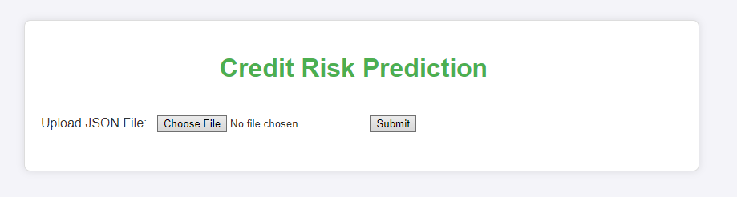
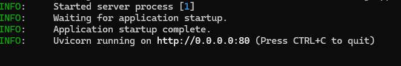
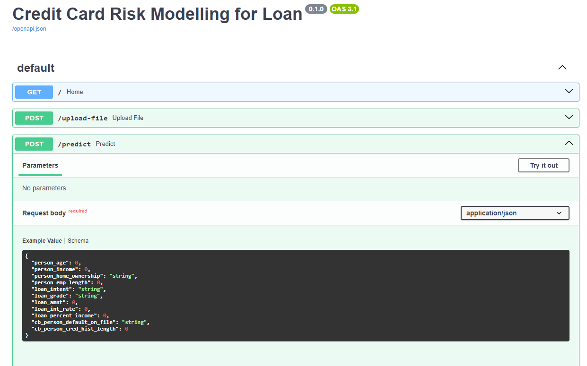
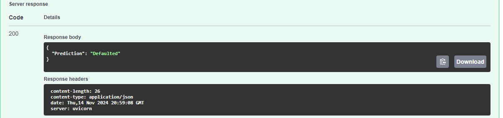
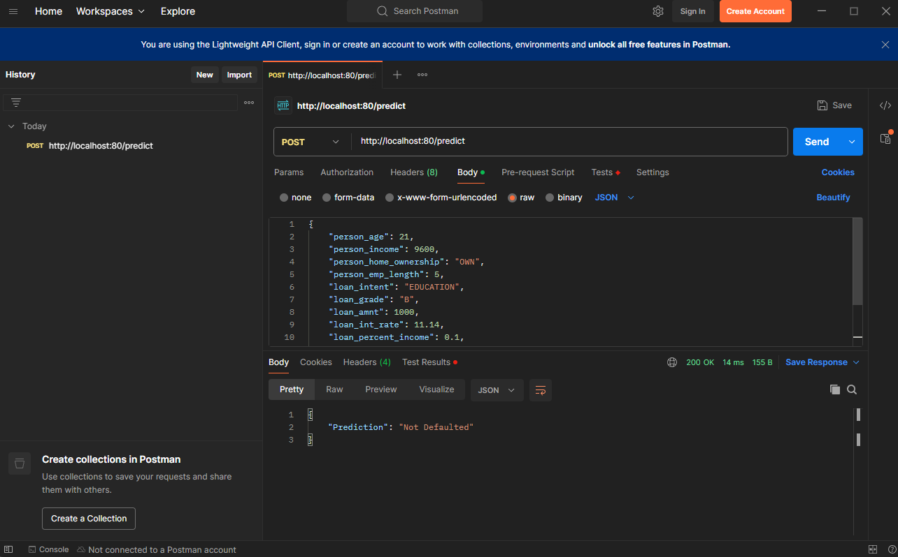

### 🏦 Credit Risk Prediction Project
Welcome to the Credit Risk Prediction Project! This initiative combines the power of machine learning with data analysis to predict the likelihood of loan defaults. Our aim is to make credit scoring more transparent and accessible for everyone involved in lending processes.

Dive in to explore:

An API that provides real-time predictions, easily accessible for integration.
A Jupyter Notebook full of in-depth data analysis and insights.
Whether you're here to see a practical ML application or to interact with a RESTful API, there’s something valuable for you!

--

## Table of Contents
1. [Project Structure](#project-structure)
2. [Cloning the Repository](#cloning-the-repository)
3. [Jupyter Notebook Analysis](#jupyter-notebook-analysis)
4. [FastAPI Loan Default Prediction API](#fastapi-loan-default-prediction-api)
5. [FastAPI Loan Default Prediction WebUI](#fastapi-loan-default-prediction-webui-using-api)
6. [Dockerizing the API Server](#dockerizing-the-api-server)

### Project Structure
```plaintext
Credit-Risk-Prediction/
├── app/
│   ├── app.py                    # Main API file with FastAPI code for handling predictions
│   ├── Dockerfile                 # Docker setup for deploying the API
│   ├── requirements.txt           # Dependencies for the API environment
│   └── static/                    # Static files (e.g., CSS, JavaScript)
│   |    └── style.css              # Stylesheet for the web interface
|   ├── templates/
│   |      └── index.html                 # HTML template for web-based predictions
|   ├── ML_artifact/
│   |       └── RandomForest_Best.sav      # Serialized machine learning model (Random Forest)
|   |data/
|       └── Sample_input1.json          # Example input file for API testing
|        |__ Sample_input2.json          #Example input file for API testing
│──Credit_Risk_Modelling.ipynb # Jupyter Notebook with in-depth data analysis
|── Requirements.txt            # Requirements file specific to Jupyter notebook
├── README.md                      # Project documentation (this file)
```
### Cloning the Repository
To get started, you’ll first need to clone the repository to your local machine. Open a terminal and run the following command:


To get started, clone the repository to your local machine using the following command:

```bash
git clone https://github.com/NirajanKhadka/Credit_Card_Risk_Modelling

```
### Jupyter Notebook Analysis

The Jupyter Notebook in this project provides an in-depth analysis and implementation of the **credit risk prediction model**. This includes data exploration, preprocessing, model building, and evaluation, offering a comprehensive guide for understanding credit risk prediction.

# go to folder
```bash
cd Credit_Card_Risk_Modelling
```
### Requirements

Install the notebook’s dependencies listed in `requirements.txt`:

```bash

pip install -r requirements.txt
```

Activate your environment, if applicable, and launch Jupyter Notebook:
```bash
jupyter notebook Credit_Risk_Modelling.ipynb
```

# Notebook Highlights
**Data Analysis and Preprocessing**: Exploratory analysis, handling missing values, feature engineering, and scaling.
**Model Building**: Various classifiers to predict credit risk.
**Evaluation Metrics**: Visualizations of accuracy, precision, recall, and F1 scores.


### FastAPI Loan Default Prediction API

The ml pipeline includes a RandomForestClassifier for classifying the loan borrowers as **defaulted / not-defaulted**.

### Building API using FastAPI framework
The API code must be in **'main.py'** file within a directory **'app'** according to FastAPI guidelines.

Import the required packages
```python
#importing file for server
import joblib
import pandas as pd
from fastapi import FastAPI, UploadFile, File,HTTPException
from pydantic import BaseModel
from fastapi.templating import Jinja2Templates
from fastapi.responses import HTMLResponse
from fastapi.staticfiles import StaticFiles
from fastapi import Request
import json

```

### Representing the loan data point
To represent a sample of loan details along with the data type of each atttribute , a class needs to be defined using the ```BaseModel``` from the pydantic library.
```python
### Defining base class to represent data points for predictions
class Credit_Model(BaseModel):
    person_age: int
    person_income: int
    person_home_ownership: str
    person_emp_length: float
    loan_intent: str
    loan_grade: str
    loan_amnt: int
    loan_int_rate: float
    loan_percent_income: float
    cb_person_default_on_file: str
    cb_person_cred_hist_length: int
```

### Loading the Machine Learning Pipeline
To load the machine learning pipeline for prediction, we set up a startup function in the server. By using @app.on_event("startup"), this function runs automatically when the server launches, loading the model into memory right at the beginning.

The ml pipeline is stored in app/ML_artifact' directory.

```python
@app.on_event("startup")
def load_ml_pipeline():
    global RFC_pipeline
    RFC_pipeline = pickle.load(open('app/ML_artifact/RFC_pipeline.sav', 'rb'))
```

### Setting up the Prediction Endpoint

The server’s endpoint at /predict processes incoming prediction requests using the trained pipeline. With a POST request, this endpoint expects loan data in JSON format to return a prediction.

```python
# REST API for prediction (Returns JSON)
@app.post("/predict")
def predict(inference_request: Credit_Model):
    try:
        input_dictionary = {
            "person_age": inference_request.person_age,
            "person_income": inference_request.person_income,
            "person_home_ownership": inference_request.person_home_ownership,
            "person_emp_length": inference_request.person_emp_length,
            "loan_intent": inference_request.loan_intent,
            "loan_grade": inference_request.loan_grade,
            "loan_amnt": inference_request.loan_amnt,
            "loan_int_rate": inference_request.loan_int_rate,
            "loan_percent_income": inference_request.loan_percent_income,
            "cb_person_default_on_file": inference_request.cb_person_default_on_file,
            "cb_person_cred_hist_length": inference_request.cb_person_cred_hist_length
        }

        inference_request_Data = pd.DataFrame(input_dictionary, index=[0])
        prediction = RF_pipeline.predict(inference_request_Data)
        result = "Not Defaulted" if prediction == 0 else "Defaulted"

        return {"Prediction": result}
    except Exception as e:
        raise HTTPException(status_code=500, detail=str(e))
```

### FastAPI Loan Default Prediction WebUI

### 1. Navigate to the `app` directory:
Change to the directory containing the FastAPI app.
```bash
cd app
```
### 2. Install required dependencies:
Install the dependencies listed in the requirements.txt file.
```python
pip install -r requirements.txt
```
This will install all necessary libraries, such as FastAPI, Uvicorn, scikit-learn, and pandas.
### 3. Start the FastAPI server:
Now, go to the terminal and type 
```bash
uvicorn app.main:app --reload
```
### 4. Access the Web UI:
This will start the server , to access the WebUi type

```bash 
http://localhost:8000
```
<p align="center">
  
</p>

You can now upload a valid JSON file to make predictions on loan defaults.

### Dockerizing the API Server

The Docker container will run on Localhost.

```
app/
│   ├── app.py                    # Main API file with FastAPI code for handling predictions
│   ├── Dockerfile                 # Docker setup for deploying the API
│   ├── requirements.txt           # Dependencies for the API environment
│   └── static/                    # Static files (e.g., CSS, JavaScript)
│   |    └── style.css              # Stylesheet for the web interface
|   ├── templates/
│   |      └── index.html                 # HTML template for web-based predictions
|   ├── ML_artifact/
│   |       └── RandomForest_Best.sav      # Serialized machine learning model (Random Forest)
|   |data/
|       └── Sample_input1.json          # Example input file for API testing
|        |__ Sample_input2.json          #Example input file for API testing

```

## Creating the Dockerfile
Now in the base directory, a file is created ```Dockerfile``. The ```Dockerfile``` contain all the instructions required to build the docker image.

```Dockerfile
# Use the base image with Python 3.7
FROM python:3.8-slim

# Set the working directory
WORKDIR /app

# Copy requirements file to the working directory
COPY requirements.txt .

# Install dependencies
RUN pip install --no-cache-dir -r requirements.txt

# Expose port 80 for FastAPI
EXPOSE 80

# Copy the application code to the container
COPY . .

# Run the FastAPI application
CMD ["uvicorn", "main:app", "--host", "0.0.0.0", "--port", "80"]

```
### Explanation

1. FROM python:3.8-slim: Uses a slim version of Python 3.8 as the base image to minimize the size of the container.
2. WORKDIR /app: Sets the working directory to /app inside the container.
3. COPY requirements.txt .: Copies the requirements.txt file from your project to the working directory in the container.
4. RUN pip install -r requirements.txt: Installs all dependencies listed in the requirements.txt file.
5. EXPOSE 80: Exposes port 80, which is used by FastAPI to listen for requests.
6. COPY . .: Copies all files from the local directory to the container's working directory.
7. CMD ["uvicorn", "main", "--host", "0.0.0.0", "--port", "80"]: Starts the FastAPI server using Uvicorn when the container is run.

## Build the Docker Image
To build the Docker image, run the following command in the base directory, where the Dockerfile is located:
```Dockerfile
docker build -t Credit_status:ml .
```
The `-t` flags is used for specifying the **name:tag** of docker image.

The `.` makes sure to run on the current working directory
## Run the Docker Container
Once the Docker image is built, start the container with this command:
```Dockerfile
docker run -p 80:80 Credit_status:ml
```
The `-p 80:80` flag maps port 80 from the container to port 80 on your local machine, allowing you to access the application.

<p align="center">
  
</p>

## Make Inference Requests to Dockerized Server
Now that our server is listening on port 80, a `POST` request can be made for predicting the class of loan.

The requests should contain the data in `JSON` format.

```JSON
{
    "person_age": 22,
    "person_income": 59000,
    "person_home_ownership": "RENT",
    "person_emp_length": 23,
    "loan_intent": "PERSONAL",
    "loan_grade": "D",
    "loan_amnt": 35000,
    "loan_int_rate": 16.02,
    "loan_percent_income": 0.59,
    "cb_person_default_on_file": "Y",
    "cb_person_cred_hist_length": 3
  }
```
### FastAPI built-in Client
FastAPI has built in client that can be used to interact with deployed server.

```bash
http://127.0.0.1/docs#/default/predict_predict_post
```
<p align="center">
  
</p>

<p align="center">
  
</p>

### Automation on the deployed server

*Postman* command be used for this. Postman is a powerful tool for interacting with APIs, and it can also be used to automate testing and requests to your server.

### 1. Create a Request in Postman:

Open Postman and click on "New" to create a new request.
Set the HTTP method to POST and enter the URL, for example, http://localhost:80/predict.
In the "Body" section, select raw and set the type to JSON. Paste the JSON input you want to send to the server.
##Automating with Collections:

Postman allows you to create Collections, which are groups of requests.
You can run all the requests in the collection automatically using the Collection Runner. This can be done in a sequence, and you can provide data from a CSV or JSON file to test with multiple sets of inputs.
### 2. Using Newman for Command Line:

Newman is a command-line tool that allows you to run Postman collections outside the Postman interface, enabling automation in CI/CD pipelines.

After exporting a Postman collection, you can run it using the newman run command.

### 3. Automating Requests with Environment Variables:

You can set up environment variables in Postman to automatically change values like URLs or authentication tokens between different environments (e.g., local, development, production).

### Example: Running the Request Automatically
1. Add the URL http://localhost:80/predict and JSON data to a Postman request.
2. Save the request in a collection.
3. Use the Collection Runner to run the requests, either with predefined data or dynamically using external files.

<p align="center">
  
</p>